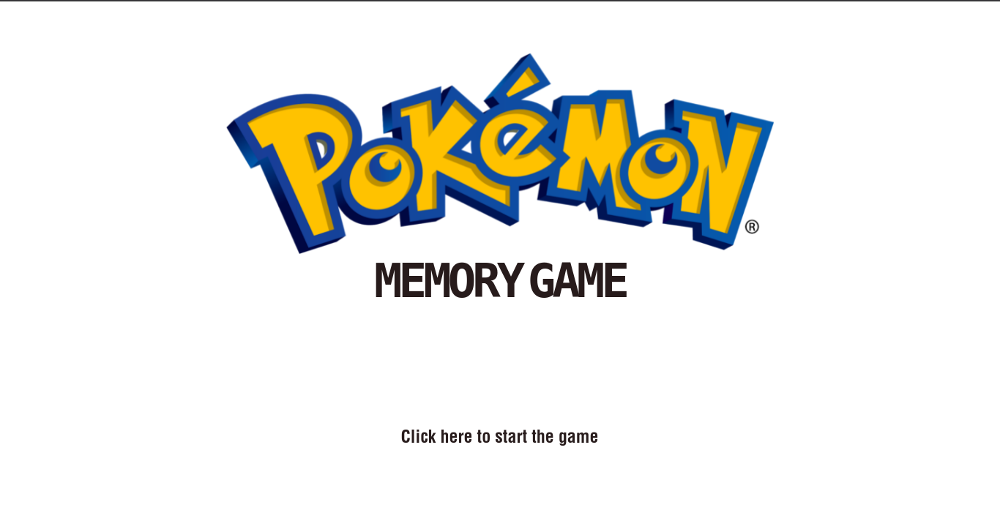

#  Pokemon Memory Game
### Inspired from [Ania Kubów's](https://www.youtube.com/channel/UC5DNytAJ6_FISueUfzZCVsw) [Learn JavaScript by Building 7 Games - Full Course](https://www.youtube.com/watch?v=lhNdUVh3qCc) video.

> I added a lot of extended features to this project. Make sure you checkout script.js file

 

## Starting

## Difficulty

## Game

## Game won

